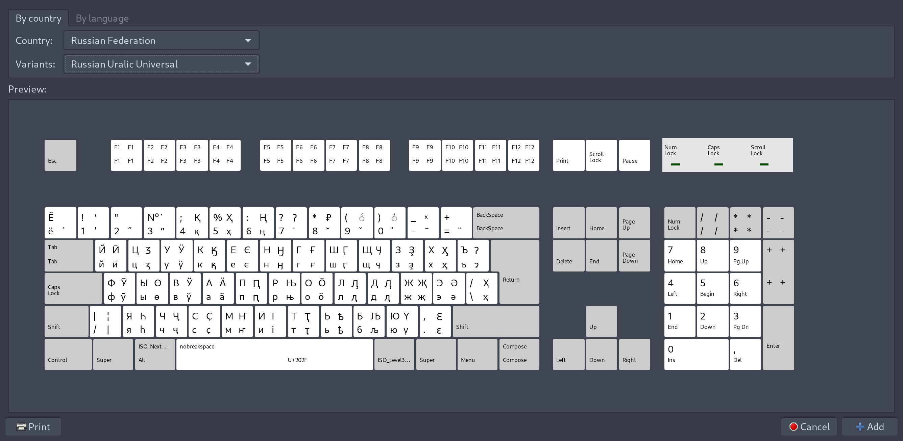
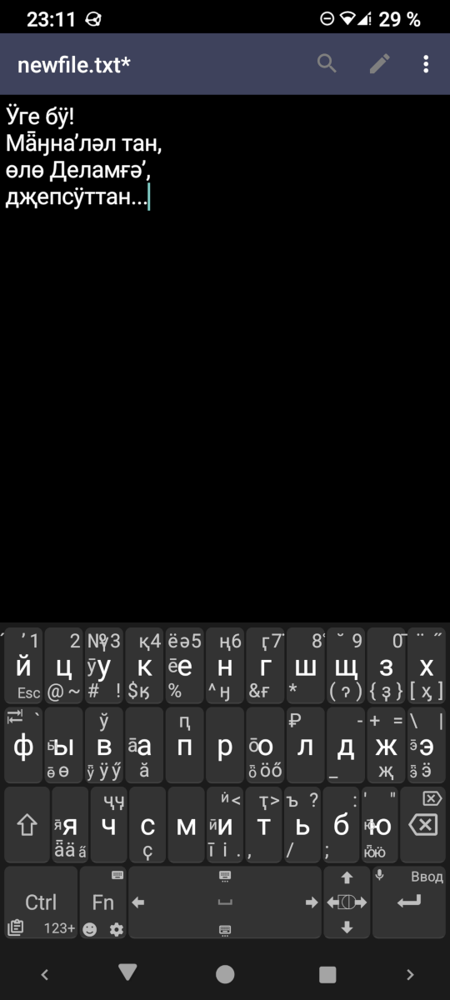

# Uralic-keyboard-layouts

A set of Linux shell scripts that install XKB keyboard layouts for the Cyrillic-based writing systems used for various Uralic languages.

1. **install_uralic_universal.sh** - the Uralic Universal layout, which includes characters for almost all Cyrillic alphabets for the Uralic and some Turkic languages.
2. **install_selkup_kamassian.sh** - the Selkup / Kamassian layout. Used for the Selkup and Kamassian languages. The Kamassian alphabet is described in a separate document (in Russian, see the 'doc' directory).

Each script can install, uninstall and test the install of a layout.

**NOTE**: After installation look for the layout in the Keyboard Settings, in the list of layouts for Russian Federation (in GNOME, MATE, Cinnamon). If the layout is not visible in the list then *logout and login* (or reboot).

Requires **xmlstarlet**. Hopefully Bourne Shell-compatible.

The CLI is in Russian but everything else, including internal comments, is in English, so it is easily translatable and may be used as a template for those who wish to make their own custom keyboard layout installer for Linux.

## Unexpected Keyboard Layout (Android)

**unexpected_keyboard/selkup_kamassian.xml** - the Selkup / Kamassian layout for [Unexpected Keyboard](https://github.com/Julow/Unexpected-Keyboard) (Android). To install open the XML file in any text editor, select all, copy to clipboard, add the Custom Layout in the Unexpected Keyboard settings, select all and paste to overwrite the existing layout definiton text.

---

Набор шелл-скриптов для Linux, устанавливающих XKB раскладки клавиатуры для кириллических алфавитов, использующихся в различных языках уральской языковой семьи.

1. **install_uralic_universal.sh** - Uralic Universal (Уральская универсальная). Кириллическая раскладка клавиатуры для набора текстов практически на всех уральских и некоторых тюркских языках. Исключениями являются, вероятно, только саамская письменность и письменность коми В. А. Молодцова (молодцовский алфавит).
2. **install_selkup_kamassian.sh** - Selkup / Kamassian (Селькупская / камасинская). Кириллическая раскладка для селькупского и камасинского языков. Камасинская азбука описана в прилагаемой работе (см. директорию "docs").

Каждый скрипт способен установить, удалить раскладку или проверить наличие уже установленной.

**ВНИМАНИЕ**: после установки ищите раскладку в настройках клавиатуры, в списке раскладок для России (в средах GNOME, MATE, Cinnamon). Если раскладка не видна - *перелогиньтесь* (или перезагрузитесь).

Из внешних утилит требуется только **xmlstarlet**. Скрипты теоретически совместимы с Bourne Shell.

Любой из скриптов можно использовать как заготовку для изготовления установщиков собственных раскладок подобного типа.

Все раскладки полностью соответствуют обычной русской ("Win") и могут быть использованы вместо неё, т.к. все дополнительные знаки получаются при удержании правой клавиши Alt (для заглавных букв, соответственно, правый Alt + Shift).

## Uralic Universal (Уральская универсальная) ##

- *1-й ряд*:
    - **`** - ударе́ние
    - **1** - апострофʼ (модификатор)
    - **Shift+1** - обратная ʽкавычка (модификатор)
    - **2** - двойной а̋кут
    - **3** - двойной апострофˮ (модификатор)
    - **Shift+3** - перевёрнутая ʻкавычка (модификатор)
    - **4** - қ
    - **5** - ҳ
    - **6** - ң
    - **7** - верхняя то̇чка
    - **Shift+7** - ʔ
    - **8** - брӗве
    - **Shift+8** - ₽
    - **9** - каро̌н
    - **Shift+9** - левый по͑лукруг
    - **0** - правый полукругʾ (некомбинируемый)
    - **Shift+0** - правый по͗лукруг
    - **-** макро̄н
    - **Shift+-** ˣ
    - **=** диерезӥс
- *2-й ряд*: **й** - ӣ, **ц** - ӡ, **у** - ӱ, **к** - ӄ, **е** - є, **н** - ӈ, **г** - ғ, **ш** - ӷ, **щ** - ӌ, **з** - ҙ, **х** - ӽ, **ъ** - ɂ
- *3-й ряд*: **ф** - ӯ, **ы** - ө, **в** - ў, **а** - ӓ, **п** - ԥ, **р** - њ, **о** - ӧ, **л** - ԓ, **д** - ӆ, **ж** - җ, **э** - ә, **\\** - ҳ
- *4-й ряд*: **я** - һ, **ч** - ҷ, **c** - ҫ, **м** - ҥ, **и** - і, **т** - ҭ, **ь** - ҍ, **б** - љ, **ю** - ү, **.** - ԑ
- *5-й ряд*: **пробел** - узкий неразрывный пробел

## Selkup / Kamassian (Селькупская / камасинская) ##

- *1-й ряд*:
    - **`** - ударе́ние
    - **1** - апострофʼ (модификатор)
    - **2** - ā
    - **3** - ӯ
    - **4** - қ
    - **5** - ē
    - **6** - диерезӥс
    - **7** - ғ
    - **8** - ō
    - **9** - левый по͑лукруг
    - **Shift+9** - ˣ
    - **0** - брӗве
    - **-** макро̄н
    - **=** - двойной а̋кут
- *2-й ряд*: **й** - ӣ, **у** - ӱ, **к** - ӄ, **е** - ә, **н** - ӈ, **г** - ӷ, **з** - ҙ, **х** - ӽ, **ъ** - ɂ
- *3-й ряд*: **ы** - ө, **а** - ӓ, **о** - ӧ, **ж** - җ, **э** - ӭ, **\\** - ă
- *4-й ряд*: **ч** - ҷ, **c** - ҫ, **и** - і, **т** - ҭ, **ю** - ү, **.** - верхняя то̇чка
- *5-й ряд*: **пробел** - узкий неразрывный пробел

## Раскладка для Unexpected Keyboard (Android)

**unexpected_keyboard/selkup_kamassian.xml** - Селькупская / камасинская раскладка для [Unexpected Keyboard](https://github.com/Julow/Unexpected-Keyboard) (Android).

Установка:

1. Откройте файл selkup_kamassian.xml в любом текстовом редакторе (например в [Простом текстовом редакторе](https://f-droid.org/ru/packages/com.maxistar.textpad))
2. Выберите весь текст и скопируйте его в буфер обмена
3. В настройках Unexpected Keyboard нажмите "Добавить альтернативную раскладку", и выберете "Пользовательская раскладка" (в конце списка)
4. Выберите весь текст и вставьте текст из буфера, при этом весь существующий текст будет замещён.

